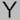

# MD Experiments 

## Images

Here is an inline image  and another  for illustration.

Here is a standalone image


## Tables

### Table1

| Column 1       | Column 2     | Column 3     |
| :------------- | :----------: | -----------: |
|  Cell Contents | More Stuff   | And Again    |
| You Can Also   | Put Pipes In | Like this \| |


### Table2

Column 1 | Column 2 | Column 3
--- | --- | ---
**Things** | _Don't_ | [Need](http://makeuseof.com)
To | *__Look__* | `Pretty`


## Code Blocks

### json

```json
{
  "firstName": "John",
  "lastName": "Smith",
  "age": 25
}
```

### python

```python
SECTION_ID = 36

def read_config_file(config): #returns a dict
    cfg = config['DEFAULT']
    config_dict = {key:cfg[key] for key in cfg.keys()}
    return config_dict
```
